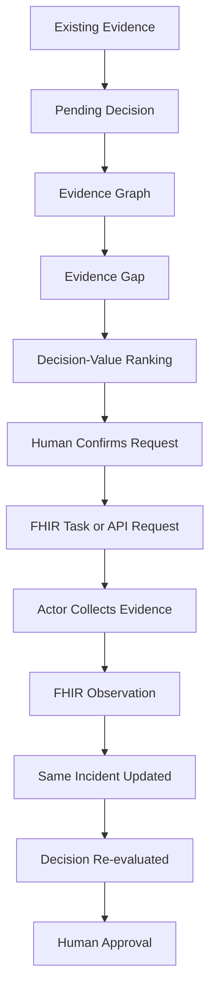
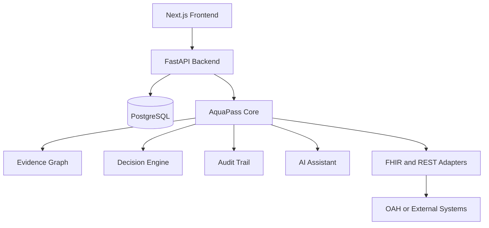
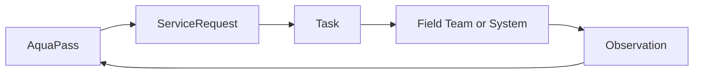

# AquaPass

## Decision-Aware Evidence Orchestration for One Health

> **What do we need to know next, which decision will it change, and why now?**

AquaPass is a decision-support and interoperability platform for urban aquatic One Health. It helps a human decision-maker identify the most important missing evidence, choose what is worth collecting under real-world constraints, send a structured request to the right actor or system, and return the result to the same incident for a human-approved decision update.

**Track:** Track 7 — Digital Health Standards  
**Hackathon:** OneAquaHealth IEEE Global Hackathon 2026  
**Project status:** MVP in development  
**Team:** Quân, Sang and Phú

---

## Table of Contents

- [Project in 30 Seconds](#project-in-30-seconds)
- [The Problem](#the-problem)
- [Our Solution](#our-solution)
- [Why AquaPass Is Different](#why-aquapass-is-different)
- [Core Workflow](#core-workflow)
- [Demo Scenario](#demo-scenario)
- [Key Features](#key-features)
- [System Architecture](#system-architecture)
- [AI Rules and Human Responsibilities](#ai-rules-and-human-responsibilities)
- [Decision-Value Ranking](#decision-value-ranking)
- [FHIR Interoperability](#fhir-interoperability)
- [Data Model](#data-model)
- [API Design](#api-design)
- [Project Structure](#project-structure)
- [Technology Stack](#technology-stack)
- [Getting Started](#getting-started)
- [Team Ownership](#team-ownership)
- [Development Workflow](#development-workflow)
- [Evaluation Plan](#evaluation-plan)
- [Judging Criteria Alignment](#judging-criteria-alignment)
- [Safety and Scientific Boundaries](#safety-and-scientific-boundaries)
- [Current Scope and Limitations](#current-scope-and-limitations)
- [MVP Definition of Done](#mvp-definition-of-done)

---

## Project in 30 Seconds

Environmental monitoring systems can collect many observations from citizens, sensors, laboratories, weather services and satellite platforms. However, when a real decision is pending, the main problem is often not a lack of data. The problem is knowing **which missing evidence matters most right now**.

AquaPass connects a pending decision to the evidence needed to improve it. The system:

1. reads the current incident and available evidence;
2. identifies evidence that is missing, conflicting, stale or uncertain;
3. ranks possible evidence using decision impact, reliability, cost, time and availability;
4. creates a standards-based evidence request;
5. sends the request to an appropriate actor or external system;
6. receives the new evidence through an API or FHIR resource;
7. returns it to the same incident;
8. updates the decision context for human approval.

> **We do not ask AI to make the decision. We ask it what we need to know before humans make it.**

---

## The Problem

Urban freshwater data is often spread across different people, systems and formats. A decision-maker may already have many data points but still not know:

- which evidence is missing;
- which missing evidence can change the current decision;
- whether that evidence can arrive before the decision deadline;
- who should collect it;
- how to request and exchange it between systems;
- how the new evidence changes the original decision;
- why a recommendation was made.

This creates five practical gaps:

| Gap | Simple explanation |
|---|---|
| Evidence overload | A large amount of data exists, but only some of it is useful for the current decision. |
| Evidence gaps | Important information may be missing without being clearly identified. |
| Decision disconnect | A recommendation may not explain which decision it will change. |
| Resource constraints | Field teams, laboratories, sensors, time and money are limited. |
| Workflow disconnect | A recommendation may be shown, but no system requests, collects and returns the evidence. |

---

## Our Solution

AquaPass is a **decision-aware evidence orchestration layer**.

It does not replace existing OneAquaHealth tools. It complements citizen science applications, data platforms, maps and decision-support systems by adding a closed loop around a pending decision:

```text
Current evidence
      ↓
Pending decision
      ↓
Missing evidence
      ↓
Decision-aware ranking
      ↓
Evidence request
      ↓
Collection by an actor or system
      ↓
New evidence returned through FHIR or API
      ↓
Same incident updated
      ↓
Human-approved decision
```

FHIR explains **how information moves between systems**. AquaPass adds the logic for **why the information should move, which decision it supports, who should collect it and what happens when it returns**.

---

## Why AquaPass Is Different

| System type | Main question |
|---|---|
| Dashboard | What data do we have? |
| Monitoring system | What is happening? |
| Prediction system | What might happen? |
| Incident-management system | What happened and who is responding? |
| FHIR integration platform | How do systems exchange data? |
| Evidence recommendation | What evidence could be useful? |
| **AquaPass** | **What evidence is worth collecting now for this decision, and how do we obtain it?** |

The project innovation is not FHIR, information gain or evidence graphs by themselves. The innovation is combining them into an operational aquatic One Health workflow that is decision-aware, constraint-aware, interoperable, explainable, traceable, human-controlled and closed-loop.

---

## Core Workflow



The non-negotiable demonstration is:

> **Recommend → Request → Collect → Return → Same Incident → Decision Update**

If the prototype only recommends evidence but cannot request, collect and return it, the core loop is incomplete.

---

## Demo Scenario

### Incident

Fish mortality is reported at an urban freshwater monitoring site.

### Existing evidence

- fish mortality observation;
- low dissolved oxygen reading;
- recent heavy rainfall;
- satellite anomaly;
- two competing explanations.

### Pending decision

> **Should the authority escalate the field investigation?**

### Decision window

The decision should be made within two hours.

### Candidate evidence

| Candidate | Decision impact | Cost | Turnaround | Expected rank |
|---|---:|---:|---:|---:|
| Field dissolved oxygen measurement | Very high | Low | 20 minutes | 1 |
| Laboratory test | Very high | High | 3 days | 2 |
| Satellite analysis | Medium | Low | 6 hours | 3 |
| Citizen verification | Low | Very low | 1 hour | 4 |

AquaPass selects the field dissolved oxygen measurement because it has high decision impact, is available, costs less and can arrive within the decision window.

The request is assigned to a field team. The team returns:

```text
Dissolved oxygen = 3.4 mg/L
```

The result is attached to the original incident. The evidence graph and decision context are updated, and a human reviews the new recommendation.

All demo data must be clearly labelled as **prototype or simulated evidence** unless it comes from a verified real source.

---

## Key Features

### 1. Pending Decision

Every workflow begins with a clear decision question and a decision deadline. Without a target decision, “best evidence” has no clear meaning.

### 2. Evidence Graph

The Evidence Graph connects incidents, observations, hypotheses, evidence gaps and pending decisions.

Supported relationship types include:

```text
SUPPORTS
CONTRADICTS
CORROBORATES
DEPENDS_ON
MISSING
STALE
DERIVED_FROM
```

### 3. Evidence States

AquaPass distinguishes between:

- **Known:** evidence is available;
- **Missing:** required evidence is unavailable;
- **Conflicting:** available evidence points in different directions;
- **Stale:** evidence may no longer represent the current situation;
- **Low confidence:** evidence exists but has limited reliability.

### 4. Next Best Evidence

Candidate evidence is ranked using practical decision value, not information gain alone.

### 5. WHY and WHY NOT Explanations

The interface shows why one candidate ranks above another using visible scoring factors and linked evidence IDs.

### 6. Evidence Request Lifecycle

```text
DRAFT → REQUESTED → ACCEPTED → COLLECTING → SUBMITTED → VERIFIED → INGESTED → DECISION_UPDATED
```

### 7. Same-Incident Update

Returned evidence must update the original incident. It must not create an unrelated second incident.

### 8. Decision Versioning

```text
Decision v1: evidence is insufficient
        ↓
Evidence is requested and returned
        ↓
Decision v2: decision context is updated
        ↓
Human approves, edits or rejects
        ↓
Decision v3: final human action is recorded
```

### 9. No-Additional-Evidence Outcome

If no evidence candidate provides enough value, AquaPass can return:

> **No additional evidence is recommended for this decision.**

This prevents unnecessary data collection.

---

## System Architecture

AquaPass uses a modular monolith for the hackathon MVP. This keeps deployment simple while preserving clear module boundaries.



### Architectural principles

- one deployable backend during the hackathon;
- clear modules instead of unnecessary microservices;
- deterministic and inspectable ranking;
- AI outputs must follow a structured schema;
- human approval before sending a request or taking action;
- adapters isolate external systems from the AquaPass core;
- every recommendation must be traceable to evidence and configuration.

---

## AI Rules and Human Responsibilities

| Component | Responsibilities | Must not do |
|---|---|---|
| AI | Summarize evidence, suggest gaps, generate candidate evidence and explain results. | Make the final decision, invent evidence or claim unsupported causality. |
| Deterministic engine | Calculate scores, rank candidates, apply cost/time/availability rules and check thresholds. | Hide ranking logic inside a black-box model. |
| Human | Confirm gaps, edit or reject requests, approve decisions and record outcomes. | Treat an AI suggestion as automatically correct. |

AI responses should be grounded in incident data and linked evidence IDs. The application should provide a safe fallback when the AI service is unavailable.

---

## Decision-Value Ranking

The ranking engine evaluates evidence candidate `e` for pending decision `d`.

Conceptually:

```text
DecisionValue(e, d) ∝

DecisionImpact
× ExpectedUncertaintyReduction
× Reliability
× Availability
× Urgency
× DecisionWindowFit

──────────────────────────────────
Cost × TimePenalty
```

For the MVP, the implemented formula should use normalized inputs and configurable weights. The exact implementation must be documented in code and evaluation notes.

| Factor | Meaning |
|---|---|
| Decision impact | How strongly could this evidence change the pending decision? |
| Expected uncertainty reduction | How much useful uncertainty could it remove? |
| Reliability | How trustworthy is the source or collection method? |
| Availability | Can an eligible actor or system collect it now? |
| Urgency | How important is it to obtain the evidence quickly? |
| Decision-window fit | Can the result arrive before the decision deadline? |
| Cost | How much money or effort is required? |
| Time penalty | Does a long turnaround reduce its immediate usefulness? |

The score is a **prototype decision-support score**, not a validated ecological probability or clinical risk score.

---

## FHIR Interoperability

FHIR is the mechanism used to exchange evidence requests and returned observations.



### Conceptual mapping

| AquaPass concept | FHIR resource | Purpose |
|---|---|---|
| Evidence request | `ServiceRequest` | Describes which evidence is requested and why. |
| Assigned collection work | `Task` | Tracks who performs the request and its current status. |
| Returned measurement | `Observation` | Carries the measured value, unit, time and method. |
| Collection device | `Device` | Identifies the sensor or instrument when available. |
| Monitoring area | `Location` | Identifies where evidence was collected. |
| Evidence origin | `Provenance` | Records the source and transformation history. |

The final resource profiles and fields must follow the FHIR implementation guidance selected by the team.

---

## Data Model

```text
Incident
├── Evidence[]
├── Hypothesis[]
├── EvidenceGap[]
├── Decision[]
├── EvidenceRequest[]
├── Action[]
└── Outcome[]
```

| Entity | Important fields |
|---|---|
| Incident | ID, location, time, type, severity and status |
| Evidence | incident ID, type, value, unit, source, time, reliability and provenance |
| Hypothesis | incident ID, description, status and linked evidence |
| Decision | incident ID, question, decision window, status and version |
| EvidenceGap | target decision, missing information, criticality and status |
| EvidenceRequest | requested evidence, purpose, priority, cost, time, actor and lifecycle status |
| Actor | capability, availability, location and capacity |
| AuditEvent | actor, action, time, previous state and new state |

---

## API Design

The API paths below define the intended MVP contract. Their implementation status should be updated as development progresses.

| Method | Endpoint | Purpose |
|---|---|---|
| `POST` | `/incidents` | Create an incident. |
| `GET` | `/incidents/{id}` | Read the full incident context. |
| `POST` | `/incidents/{id}/evidence` | Add evidence to an incident. |
| `GET` | `/incidents/{id}/evidence` | List evidence attached to an incident. |
| `POST` | `/incidents/{id}/decisions` | Create a pending decision. |
| `GET` | `/decisions/{id}` | Read a decision and its current version. |
| `GET` | `/decisions/{id}/next-best-evidence` | Rank evidence candidates and return explanations. |
| `POST` | `/evidence-requests` | Create an evidence request after human confirmation. |
| `GET` | `/evidence-requests/{id}` | Read request details and current status. |
| `POST` | `/evidence-requests/{id}/accept` | Allow an actor to accept the request. |
| `POST` | `/evidence-requests/{id}/result` | Submit returned evidence. |
| `POST` | `/decisions/{id}/approve` | Approve, edit or reject the updated decision. |
| `GET` | `/incidents/{id}/timeline` | Read the full incident and decision history. |
| `GET` | `/fhir/ServiceRequest/{id}` | Read the interoperable request resource. |
| `GET` | `/fhir/Task/{id}` | Read the interoperable task resource. |
| `GET` | `/fhir/Observation/{id}` | Read a returned observation resource. |

---

## Project Structure

```text
aquapass/
├── frontend/                       # Phú: user interface
│   ├── public/                     # Static images and assets
│   ├── src/
│   │   ├── app/
│   │   │   ├── incidents/         # Incident and pending-decision pages
│   │   │   └── requests/          # Evidence-request pages
│   │   ├── components/
│   │   │   ├── decision/          # Decision cards and before/after view
│   │   │   ├── evidence/          # Evidence Graph and evidence states
│   │   │   ├── requests/          # Request forms and approval controls
│   │   │   ├── timeline/          # Request and decision timelines
│   │   │   └── ui/                # Shared UI components
│   │   ├── hooks/                 # Reusable React logic
│   │   ├── lib/                   # Frontend helpers
│   │   ├── services/              # Backend API clients
│   │   ├── styles/                # Global and component styles
│   │   └── types/                 # Frontend data types
│   └── tests/                     # Frontend tests
│
├── backend/                        # Quân and Sang: backend services
│   ├── app/
│   │   ├── api/routes/            # REST and FHIR routes
│   │   ├── core/                  # Configuration and shared settings
│   │   ├── db/                    # Database connection and migrations
│   │   ├── models/                # Database models
│   │   ├── schemas/               # Request and response schemas
│   │   ├── services/              # Cross-module application services
│   │   └── modules/
│   │       ├── incident/          # Quân: incident management
│   │       ├── decision/          # Quân: decision lifecycle and versions
│   │       ├── orchestration/     # Quân: evidence-request workflow
│   │       ├── fhir/              # Quân: FHIR mapping and resources
│   │       ├── audit/             # Quân: traceability and audit history
│   │       ├── actors/            # Quân: actors and assignment
│   │       ├── evidence/          # Sang: evidence states and graph
│   │       ├── ranking/           # Sang: decision-value ranking
│   │       ├── constraints/       # Sang: cost, time and capacity rules
│   │       └── ai/                # Sang: gap suggestions and explanations
│   └── tests/                     # API and end-to-end tests
│
├── data/                           # Sang: data and evaluation
│   ├── demo/                      # Main fish-mortality demo scenario
│   ├── fixtures/                  # Stable test fixtures
│   └── evaluation/                # Gold set and evaluation results
│
├── docs/
│   ├── architecture/              # Architecture and database diagrams
│   ├── api/                       # API contract and examples
│   ├── fhir/                      # FHIR mapping and example resources
│   └── demo/                      # Demo script and video plan
│
├── infra/docker/                   # Local and deployment containers
├── scripts/                        # Setup, seed, reset and demo scripts
├── .github/workflows/              # Automated checks
├── .env.example                    # Environment-variable template
├── .gitignore                      # Ignored local files
├── STRUCTURE.md                    # Vietnamese structure guide
└── README.md                       # Main project documentation
```

The shorter Vietnamese directory guide is available in [`STRUCTURE.md`](STRUCTURE.md).

---

## Technology Stack

| Layer | Planned technology | Reason |
|---|---|---|
| Frontend | Next.js, React and TypeScript | Fast development, reusable components and clear user flows |
| Backend | FastAPI and Python | Strong API support and convenient integration with data/AI code |
| Database | PostgreSQL | Reliable relational storage for incidents, decisions and audit history |
| Interoperability | FHIR R4 and REST APIs | Standards-based request and observation exchange |
| AI | Structured LLM output | Evidence-gap suggestions, candidate generation and explanation |
| Decision engine | Deterministic Python rules | Transparent and testable ranking |
| Deployment | Docker-based deployment | Consistent local and hosted environments |
| Testing | Pytest and frontend test tools | Unit, API and workflow verification |

The team may adjust individual libraries while keeping the architecture and API contracts stable.

---

## Getting Started

The repository currently provides the project structure. Use the commands below after the frontend and backend setup files have been added.

### 1. Clone the repository

```bash
git clone <repository-url>
cd aquapass
```

### 2. Configure environment variables

```bash
cp .env.example .env
```

On Windows PowerShell:

```powershell
Copy-Item .env.example .env
```

Fill in the required values without committing secrets.

### 3. Start the backend

```bash
cd backend
python -m venv .venv
```

Activate the environment:

```bash
# macOS or Linux
source .venv/bin/activate

# Windows PowerShell
.venv\Scripts\Activate.ps1
```

Then install and run:

```bash
pip install -r requirements.txt
uvicorn app.main:app --reload
```

Expected local API: `http://localhost:8000`

### 4. Start the frontend

```bash
cd frontend
npm install
npm run dev
```

Expected local web application: `http://localhost:3000`

### 5. Run tests

```bash
# Backend
cd backend
pytest

# Frontend
cd frontend
npm test
```

### 6. Reset the demo

The final repository should provide a reset command in `scripts/` so every demonstration starts from the same incident and data state.

---

## Environment Variables

| Variable | Purpose |
|---|---|
| `DATABASE_URL` | PostgreSQL connection string |
| `API_HOST` | Backend host address |
| `API_PORT` | Backend port |
| `NEXT_PUBLIC_API_URL` | Backend URL used by the frontend |
| `LLM_API_KEY` | API key for the selected AI provider |
| `LLM_MODEL` | Model name used for structured AI tasks |

Never commit real secrets to the repository.

---

## Team Ownership

| Member | Main ownership | Key output |
|---|---|---|
| **Phú** | Frontend and UX | Decision-first interface, Evidence Graph view, request workflow, timelines, accessibility and demo footage |
| **Quân** | Backend and interoperability | Database, API, FHIR, request state machine, same-incident update, audit trail and deployment |
| **Sang** | Data and intelligence | Demo data, evidence states, AI suggestions, deterministic ranking, constraints and evaluation |

### Simple team rule

- Phú mainly edits `frontend/`.
- Quân owns backend database, API, FHIR and orchestration modules.
- Sang owns `data/` and the evidence, ranking, constraints and AI modules.
- Any change to shared database models, API schemas or FHIR mappings must be agreed by the team first.

---

## Development Workflow

### Recommended branches

```text
main                Stable demo-ready code
develop             Integrated development branch
feature/fe-*        Phú's frontend work
feature/be-*        Quân's backend and FHIR work
feature/ai-*        Sang's data and intelligence work
```

### Before merging

1. Pull the latest `develop` branch.
2. Run relevant tests.
3. Check that no secrets or large local files are included.
4. Explain the change in the pull request.
5. Ask the owner of an affected shared contract to review it.
6. Merge only when the main demo flow still works.

### Shared contracts

Treat these as team contracts:

- database models;
- API request and response schemas;
- FHIR mappings;
- ranking input definitions;
- demo data identifiers.

---

## Evaluation Plan

### Experiment A: Ranking quality

Compare an information-gain-only ranking with AquaPass decision-aware ranking. Measure Top-1 agreement with a small expert-defined gold set.

### Experiment B: Time to useful evidence

Measure the time from pending-decision creation to evidence request and evidence return.

### Experiment C: Resource efficiency

Compare naive evidence collection with decision-aware collection using estimated collection cost, turnaround time, unnecessary requests and useful decision updates.

### Experiment D: Traceability

Check whether the system can answer:

- Why was this evidence requested?
- Which decision did it support?
- Who collected it and when?
- Which source and method were used?
- How did the decision change afterward?

Prototype results must not be described as scientific or clinical validation.

---

## Judging Criteria Alignment

| Criterion | Weight | How AquaPass addresses it |
|---|---:|---|
| Impact and OneAquaHealth alignment | 30% | Connects environmental evidence to faster, traceable and human-approved action. |
| Innovation and creativity | 20% | Adds decision-aware evidence orchestration instead of another generic dashboard or chatbot. |
| Technical implementation | 20% | Demonstrates a real stateful workflow, deterministic ranking, FHIR exchange, same-incident update and audit history. |
| Usability and user experience | 15% | Uses a decision-first interface with WHY explanations, visible status and accessible controls. |
| Feasibility and scalability | 15% | Uses a modular architecture, configurable rules and adapters for new actors, cities and systems. |

### What judges should be able to see

- real application state instead of static screens;
- a ranking that changes when inputs change;
- a human confirming the evidence request;
- a real request-status transition;
- an actual FHIR or API resource;
- evidence submitted back into the original incident;
- a visible before-and-after decision update;
- an audit trail explaining what happened.

---

## Safety and Scientific Boundaries

AquaPass is a decision-support and evidence-orchestration system.

It does **not**:

- diagnose disease;
- prove ecological causality;
- generate real evidence that was never collected;
- autonomously determine public-health action;
- replace environmental experts or authorities;
- present a prototype score as a validated probability.

Use language such as “supports,” “suggests,” “current evidence favors,” “decision relevance,” “prototype score” and “human approval required.” Avoid unsupported terms such as “proves,” “diagnoses,” “guarantees” or “causes.”

---

## Current Scope and Limitations

### MVP scope

- one main fish-mortality scenario;
- a small set of evidence types and candidate requests;
- configurable decision-value ranking;
- one complete request and return workflow;
- FHIR request and observation examples;
- human approval and audit history;
- a small gold set for prototype evaluation.

### Deliberately excluded from the MVP

- generic chatbot;
- large multi-purpose dashboard;
- autonomous decision-making;
- disease diagnosis;
- unsupported causal prediction;
- blockchain;
- microservice complexity;
- many external integrations;
- production-scale ecological validation.

### Known limitations

- most hackathon evidence may be simulated;
- scoring weights require domain-expert validation;
- AI gap suggestions can be incomplete or incorrect;
- FHIR environmental-health mapping may require further profiling;
- prototype evaluation cannot establish real-world clinical or ecological effectiveness.

---

## MVP Definition of Done

AquaPass is ready for the final demonstration only when a judge can watch this complete flow:

```text
Incident
  ↓
Pending Decision
  ↓
Evidence Gap
  ↓
Next Best Evidence
  ↓
WHY Explanation
  ↓
Human Confirmation
  ↓
Evidence Request
  ↓
Actor Assignment
  ↓
FHIR or API Exchange
  ↓
New Evidence
  ↓
Same Incident Updated
  ↓
Decision Updated
  ↓
Human Approval
  ↓
Action or Outcome
```

### Final MVP checklist

- [ ] Incident and pending decision load correctly.
- [ ] Evidence states and graph are visible.
- [ ] Ranking changes when candidate values change.
- [ ] WHY and WHY NOT explanations use real score data.
- [ ] A human can approve, edit or reject a request.
- [ ] Request lifecycle states are enforced.
- [ ] FHIR resources can be inspected.
- [ ] Returned evidence updates the same incident.
- [ ] Decision versions and audit history are visible.
- [ ] The final decision requires human approval.
- [ ] Demo data can be reset reliably.
- [ ] Public repository contains no secrets.
- [ ] Prototype limitations are stated honestly.

---

## One-Sentence Summary

> **AquaPass identifies what is missing for a pending One Health decision, determines what evidence is worth collecting under real-world constraints, coordinates its acquisition through interoperable requests, and returns the result to the same incident for human-approved action.**

---

## Closing Statement

> **We do not ask AI to make the decision. We ask it what we need to know before humans make it.**

