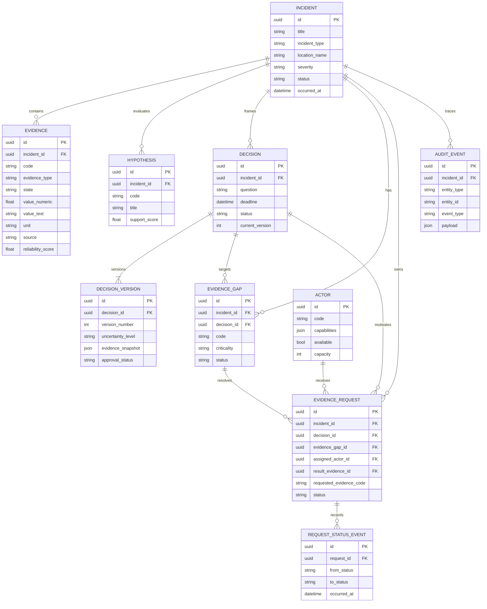

# AquaPass core database

This is the Phase 1 relational contract owned by Quân. It supports the complete closed loop while allowing Sang's intelligence modules to attach evidence states, gaps and scores later.

## Design rules

- Returned evidence always carries `incident_id`; it updates the same incident instead of creating a second one.
- Decisions are never overwritten. `decisions.current_version` points to append-only `decision_versions`.
- Request transitions are recorded in `request_status_events`.
- AI suggestions, ranking configurations and human actions are recorded as append-only `audit_events`.
- `Evidence.provenance` and `DecisionVersion.evidence_snapshot` preserve the source IDs used for an explanation.
- The active Supabase schema uses UUIDs for every ID; the seed uses stable UUIDs for reproducible references.

## Active schema and ownership

The authoritative PostgreSQL DDL is in `supabase/migrations/` and must be applied in filename order. The application query mappings are in `backend/app/db/tables.py`; they refer to tables in the `public` schema and do not create production tables. `supabase/seed.sql` is additive demo data and may be rerun without resetting an existing decision version.

`backend/schema.sql`, `backend/app/models/domain.py` and `backend/app/db/bootstrap.py` are older, unmounted drafts with string IDs. Do **not** run or import them for the Supabase UUID deployment; reconcile or retire them in a separate reviewed change.

Migration `20260917000300_workflow_foundation.sql` adds hypotheses, evidence gaps, actors, evidence requests, request-status events and audit events. Composite foreign keys enforce that a gap/request points to a decision from the same incident. `result_evidence_id` links a completed request to the returned evidence. Database status checks constrain valid values; application services still need to enforce transition order, permissions and human confirmation before those write APIs are exposed.
